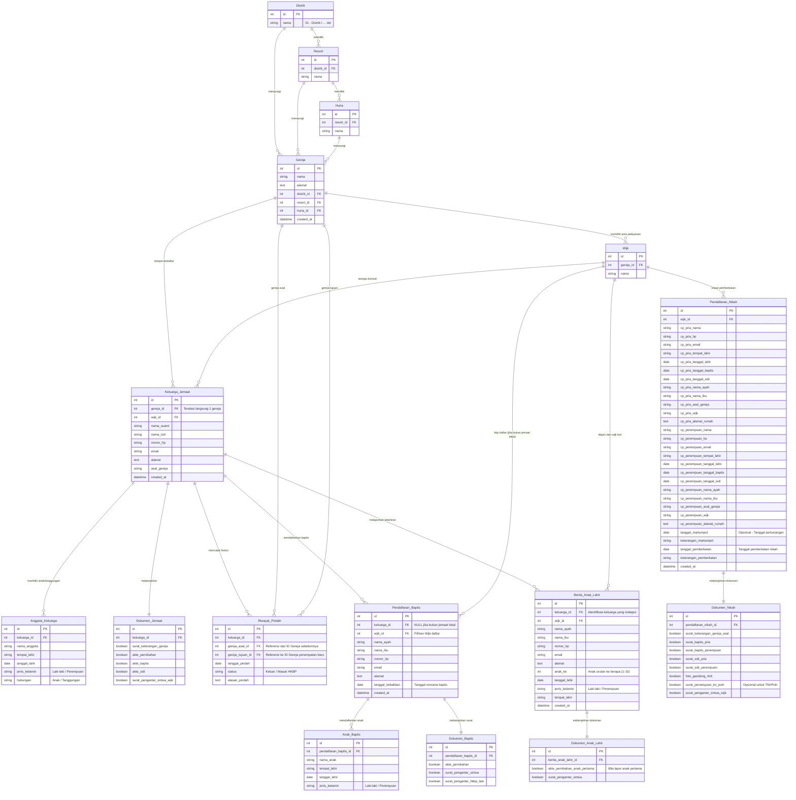

# Database Schema Gereja Komprehensif

Berikut adalah rancangan struktur **Entity-Relationship Diagram (ERD) Mermaid** yang menyeluruh dengan tambahan struktur entitas **Gereja** dan **Riwayat Pindah Jemaat** (history keanggotaan).

